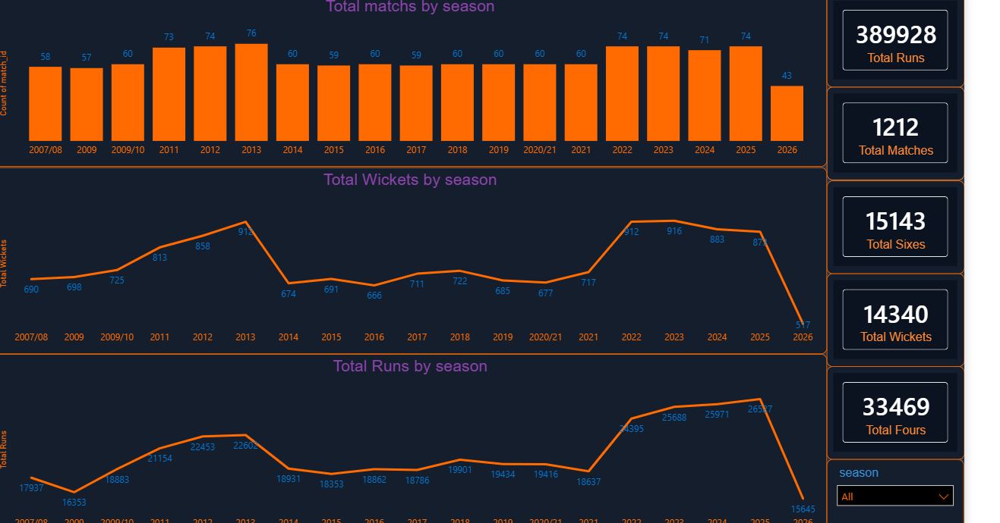
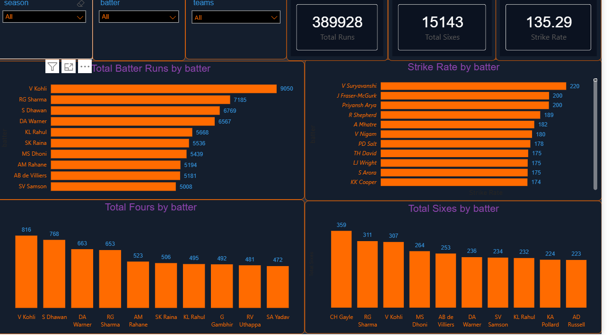
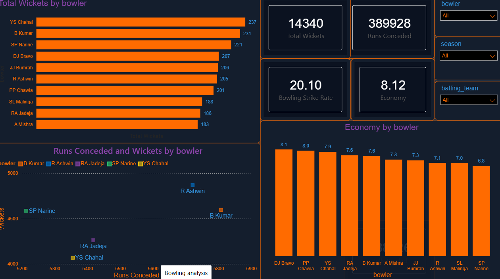
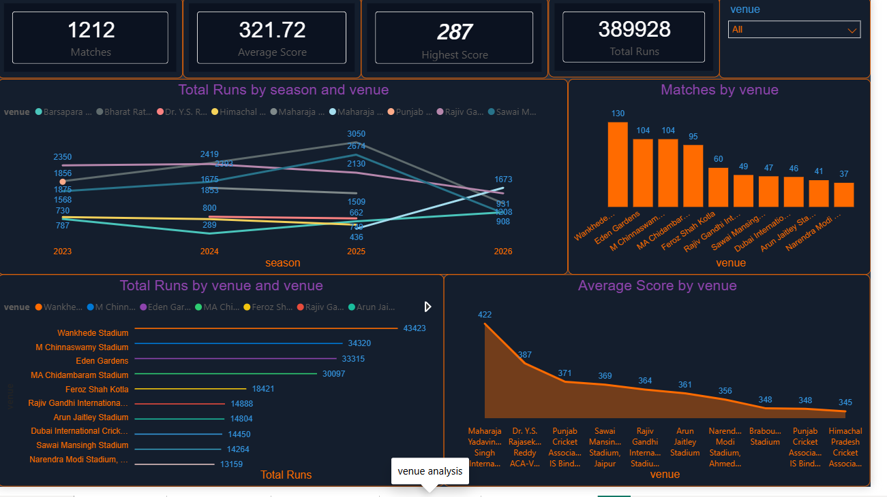
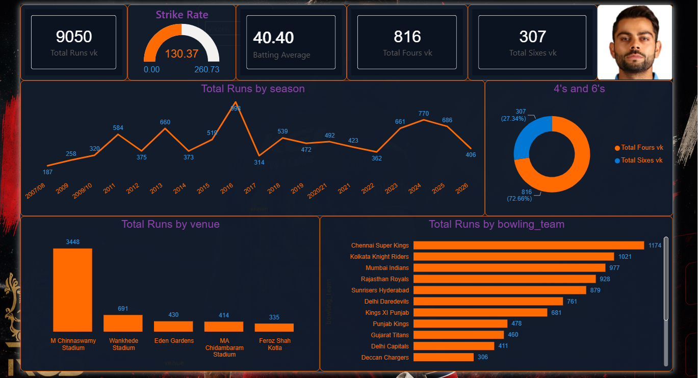

# 🏏 IPL Ball-by-Ball Analytics Dashboard

An interactive Power BI dashboard built on ball-by-ball IPL match data, covering match trends, batting and bowling performance, venue insights, and a dedicated player deep-dive on Virat Kohli.

## 📊 Overview

This project transforms raw IPL ball-by-ball data into a 5-page interactive dashboard that lets you explore the tournament from multiple angles — season-level trends, team and player batting/bowling performance, venue behavior, and a spotlight page on one of the league's most iconic players.

**Tournament snapshot:** 1,212 matches · 389,928 total runs · 33,469 fours · 15,143 sixes · 14,340 wickets

## 🗂️ Dashboard Pages

### 1. IPL Overview

Season-level snapshot of the tournament — total matches, total runs, total sixes, total wickets, and season-wise trends via bar and line charts, filterable by season.

### 2. Batting Analysis

Batting performance by player — total runs, strike rate, and boundary distribution. **V Kohli leads all-time run scoring with 9,050 runs**, followed by RG Sharma (7,185) and S Dhawan (6,769). CH Gayle tops the six-hitting charts with 359 sixes, while V Suryavanshi posts the highest strike rate at 220. Filterable by season, batter, and team.

### 3. Bowling Analysis

Bowling performance by player — wickets, economy, and bowling strike rate. **YS Chahal is the tournament's leading wicket-taker with 237 wickets**, ahead of B Kumar (231) and SP Narine (221). SP Narine also has the best economy among top bowlers at 6.8. Overall tournament bowling strike rate sits at 20.10 with an economy of 8.12. A scatter chart plots runs conceded against wickets to compare bowler efficiency.

### 4. Venue Analysis

Explores how venues influence the game. **Wankhede Stadium has hosted the most matches (130) and produced the most total runs (43,423)**, followed by M Chinnaswamy Stadium and Eden Gardens. Average score across all matches is 321.72. Includes run trends by season and venue, and average score comparisons across grounds.

### 5. King Kohli Analysis

A dedicated player page tracking Virat Kohli's career numbers: **9,050 runs, a strike rate of 130.37, and a batting average of 40.40**, with 816 fours and 307 sixes (72.7% of his boundaries are fours). He has scored the most runs against him at M Chinnaswamy Stadium (3,448) and Chennai Super Kings have conceded the most runs to him (1,174) among opposing teams.

## 🧮 Key DAX Measures

| Measure | What it calculates |
|---|---|
| `Total Matches` / `Matches` | Count of distinct matches played |
| `Total Runs` / `Total Batter Runs` | Aggregate runs scored |
| `Strike Rate` / `Batting Average` | Batting performance ratios |
| `Total Wickets` / `Wickets` | Wickets taken |
| `Economy` / `Bowling Strike Rate` | Bowling efficiency metrics |
| `Runs Conceded` / `Balls Bowled` | Bowling workload stats |
| `Total Fours` / `Total Sixes` | Boundary counts |
| `Average Score` / `Highest Score` | Scoring benchmarks |
| `Strike Rate vk` / `Total Runs vk` / `Total Fours vk` / `Total Sixes vk` | Kohli-specific performance measures |

## 🛠️ Tech Stack

- **Power BI Desktop** — data modeling, DAX measures, and report design
- **Power Query** — data cleaning and transformation
- **DAX** — custom measures for batting, bowling, and player-level KPIs

## 📁 Dataset

Built on IPL ball-by-ball match data (`ipl_ball_by_ball` table), covering deliveries, batters, bowlers, teams, venues, and seasons across IPL history (2007/08 – 2026).

## 🚀 How to Use

1. Clone or download this repository.
2. Open `ipl_dashboards.pbix` in **Power BI Desktop**.
3. Use the slicers on each page (team, season, player, venue) to filter the visuals interactively.

## 👤 Author

**Faheem Ajhar**
Aspiring Data Analyst | Python | SQL | Power BI | Excel | Statistics

- GitHub: [faheemajhar123-ctrl](https://github.com/faheemajhar123-ctrl)
- LinkedIn: [faheem-ajhar-a-b3aa74280](https://linkedin.com/in/faheem-ajhar-a-b3aa74280)
